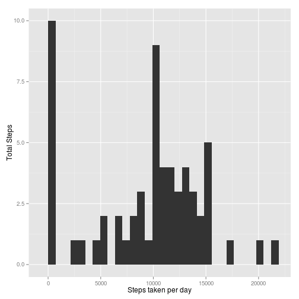

# Reproducible Research: Peer Assessment 1

```r
knitr::opts_chunk$set(echo = TRUE, message = FALSE)
```


## Loading and preprocessing the data

```r
if(!file.exists("activity.csv"))
  unzip("activity.zip")
activityData <- read.csv("activity.csv", colClasses=c("integer", "Date", "integer"))
```


## What is mean total number of steps taken per day?

```r
require(ggplot2)
mean_median_plot <- function(activity) {
  daily_sum<-aggregate(activity$steps, by=list(activity$date), FUN=sum, na.rm=T)
  colnames(daily_sum) <- c("Date", "Total.Steps")
  
  daily_mean<-mean(daily_sum$Total.Steps, na.rm=T)
  daily_median<-median(daily_sum$Total.Steps, na.rm=T)
  
  print( qplot(daily_sum$Total.Steps, geom="histogram",
               ylab="Total Steps", xlab="Steps taken per day") )
  list(daily.mean=daily_mean, daily.median=daily_median)
}

daily_mean_median<-mean_median_plot(activityData)
```

 

The historgram chart show the total steps taken per day for all intervals, with **average** steps of 9354.2295082 with **median** of 10395 per day.

## What is the average daily activity pattern?

```r
daily_mean_interval<- aggregate(activityData$steps, by=list(activityData$interval), FUN=mean, na.rm=T)
colnames(daily_mean_interval)<- c("Interval", "Avg.Steps")

max_avg_interval<- subset(daily_mean_interval, Avg.Steps==max(daily_mean_interval$Avg.Steps))

qplot(Interval, Avg.Steps, data=daily_mean_interval, 
      geom="line", ylab="Average Steps", xlab="Interval")
```

 

On average across all the days in the dataset, the 5-minute interval that contains the maximum number of steps was found in interval 835 with an average steps of 206.1698113.  


## Imputing missing values

```r
total_missing_data<- sum(is.na(activityData$steps))

intr_to_impute <- subset(activityData, is.na(steps), interval)
intr_with_avg_steps <- sapply(intr_to_impute, FUN = 
                      function(naI){
                        daily_mean_interval[daily_mean_interval$Interval==naI, "Avg.Steps"]
                      })

impute_activityData <- activityData
impute_activityData[is.na(impute_activityData$steps), "steps"] <- intr_with_avg_steps

imp_mean_median<-mean_median_plot(impute_activityData)
```

 

The historgram chart show the total steps taken per day for all intervals after NA steps are imputed, with total missing data of 2304. **New average** steps of 9530.7244046 and **new median** of 1.0439 &times; 10<sup>4</sup> per day. Compare with original data (impact), average steps has differ by 176.4948964 and median is also differ by 44.

The strategy to impute data is using the average steps from each interval across all days.

## Are there differences in activity patterns between weekdays and weekends?

```r
week<- function(date) {
  require(lubridate)
  if(class(date) != "Date")
    stop("Require date type as param")
  sapply(date, function(d) {
    wd <-wday(d, label=T)
    if(wd == "Sun" || wd == "Sat")
      "Weekend"
    else
      "Weekday"
  })
}

impute_activityData$weekday<-as.factor(week(impute_activityData$date))
week_mean_interval<- aggregate(impute_activityData$steps, by=list(impute_activityData$weekday, 
                                impute_activityData$interval), FUN=mean, na.rm=T)
colnames(week_mean_interval)<- c("Weekday", "Interval", "Avg.Steps")

qplot(Interval, Avg.Steps, data=week_mean_interval,
      geom="line", ylab="Average Steps", xlab="Interval") + facet_wrap(~Weekday, nrow = 2, ncol = 1)
```

 

Comparing Weekday and Weekend, the front interval of the day during weekday having more steps compare to weekend, where during weekend the steps distribution is more even during activity period.
